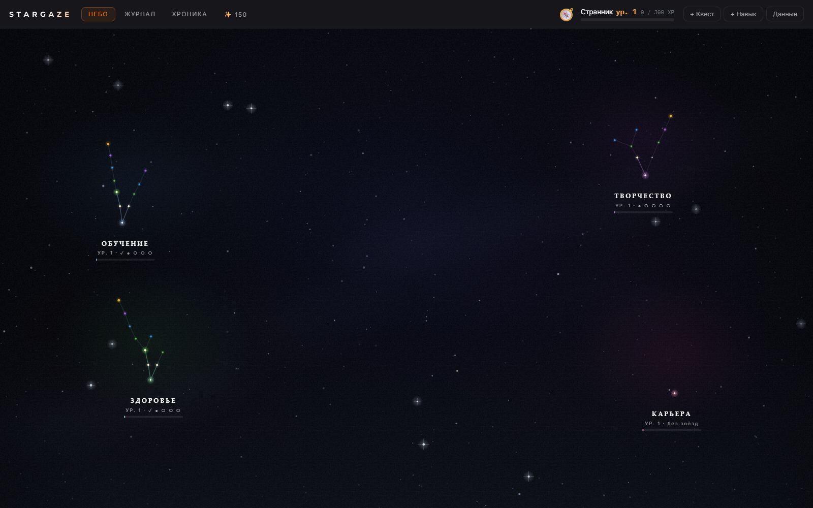

# Stargaze

Небо из твоих навыков. RPG-интерфейс над реальной жизнью: навыки —
галактики, освоенные умения — зажжённые звёзды, задачи — квесты с XP,
дедлайнами и наградами за сделанное вовремя. К Stargaze подключается
твой AI-агент в роли гейм-мастера: предлагает квесты, принимает
результаты, ведёт экономику наград.



## Запуск за минуту

```bash
git clone https://github.com/ilia-pluzhnikov/stargaze.git
cd stargaze
npm install
npm run serve   # → http://localhost:8643
```

Первый запуск создаёт демо-мир в `~/.stargaze/store.json`. Дальше это
твои данные: один JSON-файл на диске, экспорт и бэкап — копирование файла.

### Docker

```bash
docker run -d --name stargaze -p 127.0.0.1:8643:8643 \
  -v stargaze-data:/data ghcr.io/ilia-pluzhnikov/stargaze:latest
```

## Как устроено

Одно ядро — три головы:

- **Веб** — небо, журнал квестов, кошелёк наград.
- **CLI** — та же логика из терминала: `node dist-node/cli.js status`
  (в Docker: `docker exec stargaze node cli.js status`). Этим же путём
  ходят агенты.
- **HTTP API** — `GET /api/store`, `POST /api/action` — для интеграций.

## Агент как гейм-мастер

Любой агент, умеющий запускать команды или дёргать HTTP, ведёт твою
игру: предлагает квесты (`propose-quest`), принимает результаты
(`complete <id> --result "…"`), назначает награды и цены. Справка по
командам: `node dist-node/cli.js` без аргументов. MCP-сервер — в планах
([CHANGELOG](CHANGELOG.md)).

## Свой сервер

VPS с HTTPS и basic auth — [DEPLOY.md](DEPLOY.md).

## Разработка

- `npm run dev` — dev-сервер (Vite)
- `npm test` — тесты ядра; `npm run typecheck` — строгий tsc
- Инварианты кодовой базы — [CLAUDE.md](CLAUDE.md), карта кода —
  `docs/codemap/codemap.html`

Интерфейс пока на русском; английский — в планах.

## Лицензия

[AGPL-3.0](LICENSE): self-hosted использование свободно; публичный
сервис на этом коде обязан открыть свои доработки.
